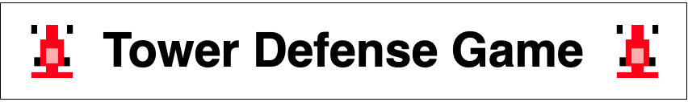
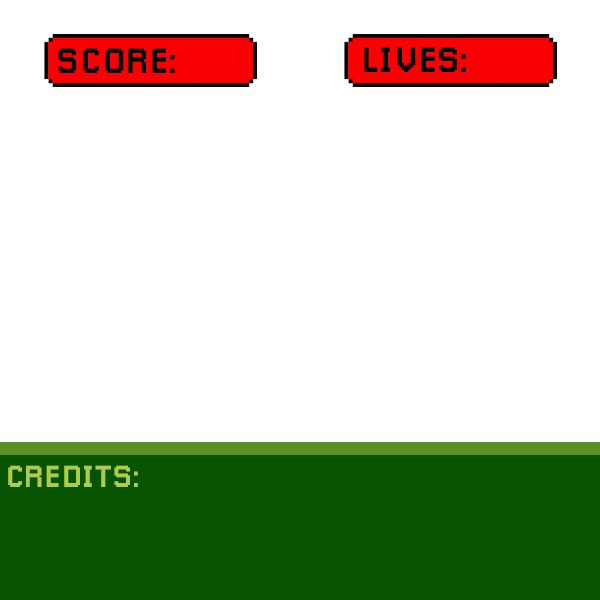
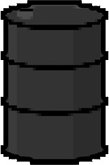
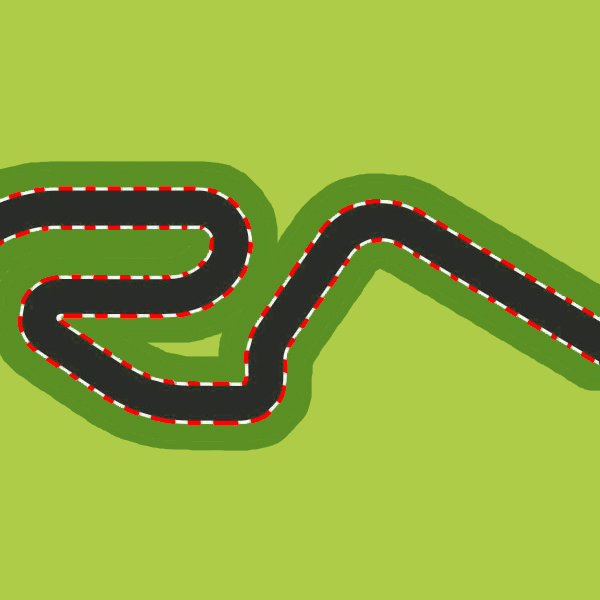
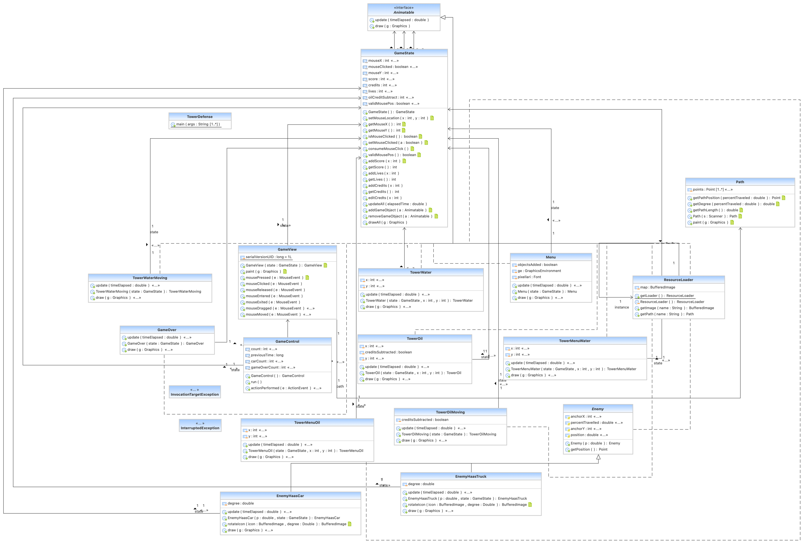
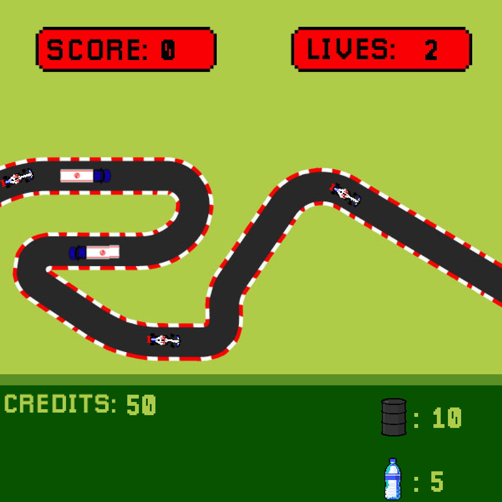

  

<h3 align="center">Authors : Ethan Bowles and Conner Fisk</h2>

___
>## About This Project

>## Current Version - 1.1
>

>## Diagrams and Resources
>

>
Resources

>  
>>

>>
GameOver.png

>>
>>  &nbsp;&nbsp;&nbsp;&nbsp;&nbsp;&nbsp; 
>>  
>>

>>

>>
HaasCar.png

>>
>>  &nbsp;&nbsp;&nbsp;&nbsp;&nbsp;&nbsp; 
>>  
>>

>>

>>
HaasTruck.png

>>
>>  &nbsp;&nbsp;&nbsp;&nbsp;&nbsp;&nbsp; 
>>  
>>

>>

>>
MenuOverlay.png

>>
>>  &nbsp;&nbsp;&nbsp;&nbsp;&nbsp;&nbsp; 
>>  
>>

>>

>>
OilBarrel.png

>>
>>  &nbsp;&nbsp;&nbsp;&nbsp;&nbsp;&nbsp; 
>>  
>>

>>

>>
path_2.png

>>
>>  &nbsp;&nbsp;&nbsp;&nbsp;&nbsp;&nbsp; 
>>  
>>

>>

>>
WaterBottle.png

>>
>>  &nbsp;&nbsp;&nbsp;&nbsp;&nbsp;&nbsp; 
>>  
>>

>
>  [View All Resources](resources) 
>
>

>

>
Diagrams

>  
>>

>>
UML Diagram

>>
>>  &nbsp;&nbsp;&nbsp;&nbsp;&nbsp;&nbsp; 
>>  
>>

> 
>

>

>
Screenshots

>
>>

>>
Game Screen

>>
>>  &nbsp;&nbsp;&nbsp;&nbsp;&nbsp;&nbsp; 
>>  
>>

>>

>>
End Game Screen

>>
>>  &nbsp;&nbsp;&nbsp;&nbsp;&nbsp;&nbsp; 
>>  
>>

> 
>

>## Code
>

>
Source Code

>  
>  - [Animatable.java](src/Animatable.java)
>  - [Enemy.java](src/Enemy.java)
>  - [EnemyHaasCar.java](src/EnemyHaasCar.java)
>  - [EnemyHaasTruck.java](src/EnemyHaasTruck.java)
>  - [GameControl.java](src/GameControl.java)
>  - [GameOver.java](src/GameOver.java)
>  - [GameState.java](src/GameState.java)
>  - [GameView.java](src/GameView.java)
>  - [Menu.java](src/Menu.java)
>  - [Path.java](src/Path.java)
>  - [ResourceLoader.java](src/ResourceLoader.java)
>  - [TowerDefense.java](src/TowerDefense.java)
>  - [TowerMenuOil.java](src/TowerMenuOil.java)
>  - [TowerMenuWater.java](src/TowerMenuWater.java) 
>  - [TowerOil.java](src/TowerOil.java)
>  - [TowerOilMoving.java](src/TowerOilMoving.java)
>  - [TowerWater.java](src/TowerWater.java)
>  - [TowerWaterMoving.java](src/TowerWaterMoving.java) 
>
>  [View All Code](src) 
>  
>

